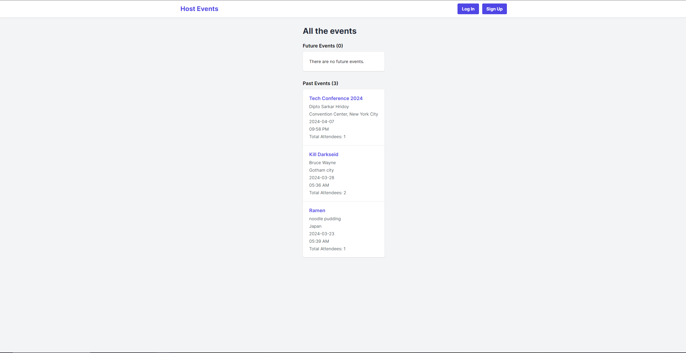
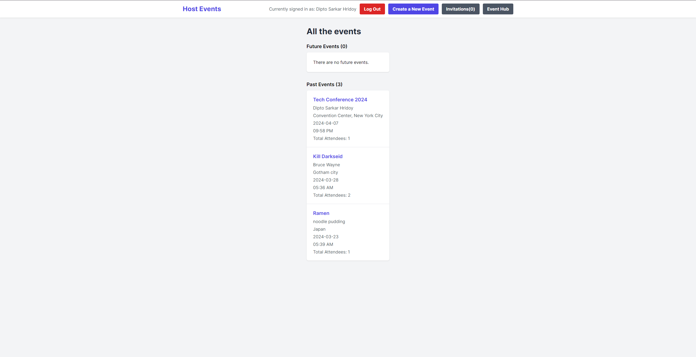

# Private Events

## Introduction

This is a event management application built with Ruby on Rails.

## Live Demo

You can see a live version of the app [here](https://private-events-khmj.onrender.com).
Please note that the app is hosted on a free tier and may take a moment to load if it has been inactive.

## Features

- User authentication with Devise.
- Users can create events.
- Users can attend many events.
- An event can be attended by many users.
- Events have a specific date and location.
- User's can see all the events user has created.
- Event's displays the details of the event and a list of attendees.
- User's can see their attended events, separated into past and future events.
- Event's index page separates past and upcoming events.
- Users can edit and delete the events they created.
- Users can remove themselves as an attendee to their attended events.

## Screenshots

## Getting Started

These instructions will get you a copy of the project up and running on your local machine for development and testing purposes.

### Prerequisites

You need to have Ruby and Rails installed on your machine. See [this guide](https://guides.rubyonrails.org/getting_started.html#creating-a-new-rails-project-installing-rails) for instructions on setting up Rails.

### Installing

1. Clone the repository: `git clone https://github.com/DiptoSarkar182/private_events.git`
2. Navigate into the project directory: `cd private_events`
3. Install the dependencies: `bundle install`
4. Set up the database: `rails db:create db:migrate`
5. Start the server: `rails server`
6. Visit `http://localhost:3000/` in your browser to access the application.